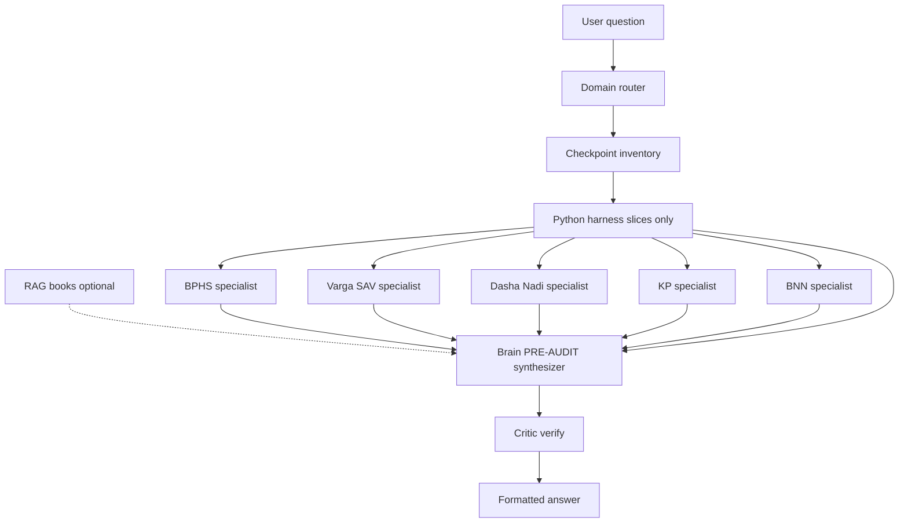

# IMPLEMENTATION_PLAN.md — Full build plan

**Canonical workdir:** `E:\astro_agents`  
**Frozen Streamlit:** `B:\n8n\astro\kp-calculator` (do not change for product features)  
**Related docs:** [PRD.md](PRD.md) (product intent) · [API.md](API.md) (HTTP contract) · [README.md](README.md) (how to run)

This is the **one document** for what to implement, what is done, and what remains. Prefer this over chat history when continuing work.

---

## 1. North star (target ecosystem)

**Today (M2.5–M2.6):** one LLM + chart tools + selective SQLite slices + optional packet planner fallback.

**Target (M4 harness — your vision):**

```
User question
    → Router (domain: finance / marriage / career / …)
    → Inventory builder (PRE-AUDIT checkpoint list for that domain)
    → Harness (Python only): fetch ONLY matching payload slices from SQLite
    → Optional RAG (books / doctrine — no numbers invented)
    → Specialist passes (optional, budget-gated): BPHS | Varga/SAV | Dasha/Nadi | KP | BNN
    → Brain synthesizer: 3-step PRE-AUDIT → inventory box → evidence audit → verdict
    → Critic: reject degrees/houses not in packet
    → User-facing formatted answer (finance-style tables)
```

**Hard rules**

| Rule | Detail |
|------|--------|
| Math | Only `engine.astro_kp.calculate_vedic_charts` — packet is authoritative |
| Harness | Agents receive **slices only**, not full dump (unless domain requires it) |
| PRE-AUDIT | Every answer: inventory → evidence audit → verdict ([PRE_AUDIT_DIRECTIVE.md](docs/prompts/PRE_AUDIT_DIRECTIVE.md)) |
| Streamlit | Frozen on `B:\` |
| Cost | `$5/mo` kill-switch; parallel specialists only when domain needs it |
| RAG | Doctrine/citations only — never replace packet numbers |

**Good news:** the engine **already computes** BPHS, bhava, shodashavarga, SAV/BAV, yogas, dasha, BNN, KP — in `structured_payload` (`natal_core`, `unified_kundali`, `ashtakavarga_sav`, `bnn_module`, `special_yogas`, `kp_*`, …). The gap is **routing + harness + multi-step Brain**, not missing math.

---

## 2. Target architecture

### Current (shipped — M2.5)

Single LLM + chart tools → SQLite slices → synthesize (KP-heavy today).

### Target harness (M4 — your finance-style ecosystem)



| Stage | Module | Status |
|-------|--------|--------|
| Domain router | `shared/domain_harness.py` | **Done** |
| PRE-AUDIT | `docs/prompts/PRE_AUDIT_DIRECTIVE.md` | Done |
| Slice fetch | `chart_tools` / SQLite + compact_facts | **Done** |
| Specialists + Brain | `shared/specialists.py` + `shared/harness_pipeline.py` | **Done** |
| RAG | `shared/rag_hnsw.py` HNSW + `search_books` | **Done** |
| Critic | `shared/critic.py` | **Done** |
| Output formatter | inventory box in Brain user packet + directive | **Done** |
| MCP calc + law search | `run_chart_query`, `search_classical_law` | **Done** |

Finance domain example: `classify_domain("finances")` → fetch `ashtakavarga_sav`, `bnn_module`, `unified_kundali`, yogas, KP cusps 2 & 11, Nadi `[2,6,10,11]` vs `[6,8,12]`.

### Runtime (laptop)

| Process | Command | Port |
|---------|---------|------|
| API | `uvicorn api.app:app --reload --port 8080` | 8080 |
| Web | `cd web && npm run dev` | 5173 |
| MCP (optional) | `python -m mcp_server.chart_mcp` | stdio |
| Trace tail | `Get-Content data\logs\pipeline.log -Wait -Tail 40` | — |

Env: copy `.env.example` → `.env` (`NVIDIA_API_KEY`, optional `NVIDIA_MODEL`).

---

## 3. Locked product choices

| Topic | Choice |
|-------|--------|
| Web | React + Vite → FastAPI |
| Default LLM | Muse Glimmer (`meta/muse-glimmer-30b`) |
| A/B LLMs | DeepSeek Flash (`deepseek-ai/deepseek-v4-flash-0731`); MiniMax often **429** on NIM |
| Prompts | `default` = ACTIVE_GEM + KP strict contract; `planet_taste` = placement/taste A/B |
| Budget | $5/mo hard cap |
| Users | You only; allowlist extensible |
| Host | Laptop now; env-based VPS later |

---

## 4. Milestone status

| ID | Deliverable | Status |
|----|-------------|--------|
| **M0** | Scaffold + engine vendor copy + PRD | **Done** |
| **M1** | Chart API + disk cache + places + usage | **Done** |
| **M2** | Web: chat history, place search, kundali, ask | **Done** |
| **M2.5** | SQLite field store + chart tools + MCP + tool agent + planner fallback + pipeline traces | **Done** |
| **M2.6** | Model A/B UI + planet_taste prompt + rate-limit handling | **Done** |
| **M3** | Telegram personal bot on same API | **Todo** |
| **M4** | **Harness ecosystem:** domain router, PRE-AUDIT Brain, specialists, RAG, critic, formatted output | **Done** |
| **M5** | Deploy packaging (api/web); Streamlit stays on B: | **Todo** |

---

## 5. What is already built (do not re-invent)

### API — `api/`

- `GET /health`, `GET /` → docs  
- `POST /v1/charts`, `GET /v1/charts/{key}`  
- `GET /v1/places`, `GET /v1/usage`, `GET /v1/models`  
- `GET /v1/harness/plan`, `POST /v1/rag/index`, `GET /v1/rag/search`  
- `POST /v1/ask` — `model`, `prompt_profile`, `use_web_law`; returns `harness_plan`, `specialist_audit`, `critic`

### Shared — `shared/`

| Module | Role |
|--------|------|
| `chart_service.py` | Compute/cache charts |
| `chart_store.py` | SQLite field rows (`data/sqlite/charts.db`) |
| `chart_tools.py` | Tool registry: list/meta/slice/cusp/planet/places |
| `ask_agent.py` | Tool-calling loop (Muse) |
| `ask_service.py` | Harness (default for domains) → tools → planner |
| `harness_pipeline.py` | PRE-AUDIT Brain orchestration |
| `specialists.py` | BPHS / Varga-SAV / Dasha-Nadi / KP / BNN extractors |
| `rag_hnsw.py` | Hashed embeddings + HNSW/brute RAG |
| `chart_query.py` | Allowlisted packet calc tool |
| `critic.py` | Degree/SAV citation check |
| `domain_harness.py` | Domain join + checkpoint inventory |
| `packet_planner.py` | Keyword slice selection for fallback |
| `llm_nvidia.py` | NIM client + tools + rate-limit errors |
| `models_catalog.py` | Allowlisted models + `supports_tools` |
| `prompts.py` / `answer_contract.py` | Prompt profiles + KP strict overlay |
| `pipeline_trace.py` | Terminal + `data/logs/pipeline.log` |
| `usage.py` / `config.py` / `places.py` | Budget, env, city search |

### MCP — `mcp_server/chart_mcp.py`

Same tools as the agent registry (stdio for Cursor).

### Web — `web/`

Sidebar chats, place typeahead, kundali/panels, ask composer with **Model** + **Prompt** dropdowns.

### Prompts — `docs/prompts/`

- `ACTIVE_GEM.md` — pasted Gem  
- `PLANET_TASTE.md` — placement/taste A/B  
- `Gemini_instructionsKP.md` + `pmp/` — KP protocol pack  

### Tests — `tests/`

Chart cache, packet planner, tools/store/agent mock, models/prompts.

---

## 6. Remaining work — implement next

### M3 — Telegram bot

**Goal:** Phone access with same chart + ask backend.

**Build**

1. `telegram/bot.py` — aiogram or `python-telegram-bot`  
2. Allowlist from `ASTRO_ALLOWLIST_IDS`  
3. Commands: `/start`, `/chart` (birth fields), `/ask`, `/usage`  
4. Call `http://127.0.0.1:8080/v1/*` (or in-process shared services)  
5. Logging + unit tests for allowlist and message parsing  
6. Update README / API.md / this plan status  

**Out of scope for M3:** public bot, payments, multi-tenant.

---

### M4 — Harness ecosystem (Brain + specialists + RAG + critic)

**Status: Done.** Python specialists + one Brain LLM; RAG HNSW; critic; MCP calc + law search.

Anti-patterns still apply: no full packet dump; LLM must not recalculate SAV; no specialist LLM fan-out on the $5 budget.

---

### M5 — Deploy

**Goal:** Run api+web off-laptop without rewriting.

**Build**

1. `Dockerfile` / compose for `api` + static `web` build  
2. Env-based CORS, host, budget  
3. Document VPS checklist  
4. Keep Streamlit deploy on B:/GitHub untouched  

---

### Quality / ops backlog (anytime)

| Item | Why |
|------|-----|
| Golden parity tests vs Streamlit samples | Success criterion #4 |
| Gemini Flash fallback wiring | PRD model ladder |
| Answer cache | Cost |
| Deterministic “field lookup” answers without LLM | Cost |
| MiniMax: keep optional; expect 429 on NIM trial | Known |
| DeepSeek: tools off by design (single-shot) | Rate-limit hygiene |
| Improve tool reliability on Muse | Empty content / reasoning budget |

---

## 7. Ask path (current behavior)

1. Load chart JSON + ensure SQLite rows  
2. Budget gate  
3. If domain/pre_audit: harness (router → compact facts → specialists → RAG → Brain → critic)  
4. Else if Muse tools: tool agent loop  
5. Else: packet planner + one synthesize  
6. Record usage; emit pipeline log  

**Tools:** chart slices + `get_harness_plan`, `search_books`, `search_classical_law`, `run_chart_query`

---

## 8. Feature completeness checklist (per new module)

When adding a module, ship all of:

- [ ] API endpoint (if user-facing)  
- [ ] Service logic  
- [ ] DB / cache interaction  
- [ ] Validation  
- [ ] Logging / pipeline marks  
- [ ] Unit tests  
- [ ] Docstrings on new modules  
- [ ] README + API.md + **this plan** status update  

---

## 9. Directory map

```
E:\astro_agents\
  IMPLEMENTATION_PLAN.md   ← you are here
  PRD.md, API.md, README.md
  .env.example
  api/                     FastAPI
  shared/                  services, tools, LLM, prompts
  mcp_server/              MCP stdio
  web/                     React + Vite
  engine/                  vendor KP math (no .git)
  docs/prompts/            Gem + KP + planet_taste + PRE_AUDIT_DIRECTIVE
  shared/domain_harness.py domain → payload key map (finance, marriage, …)
  telegram/                empty stub → M3
  tests/
  data/cache/charts/       JSON charts
  data/sqlite/             charts.db + usage
  data/logs/pipeline.log   live traces
```

---

## 10. Definition of “v1 complete”

- [x] Chart compute/cache parity path exists  
- [x] Web ask grounded in packet/tools  
- [x] Selective tools + MCP + traces  
- [x] Model/prompt A/B for quality testing  
- [x] RAG + critic + PRE-AUDIT harness (finance/health)  
- [ ] Telegram allowlisted bot  
- [ ] Deploy story  
- [ ] Golden number tests vs Streamlit samples  

---

## 11. Immediate next action

**Immediate next:** M3 Telegram, or golden Streamlit parity tests. Harness (M4) is wired.

When starting a milestone, update the status table in **§4** of this file when that milestone ships.
