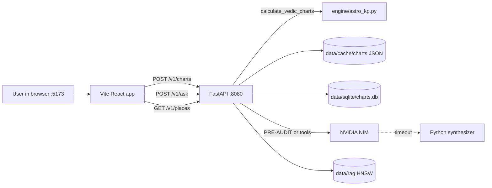
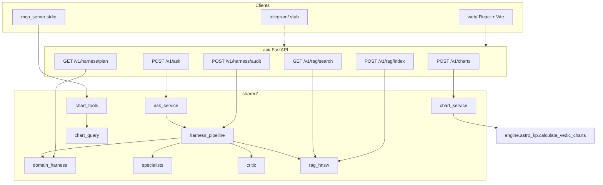
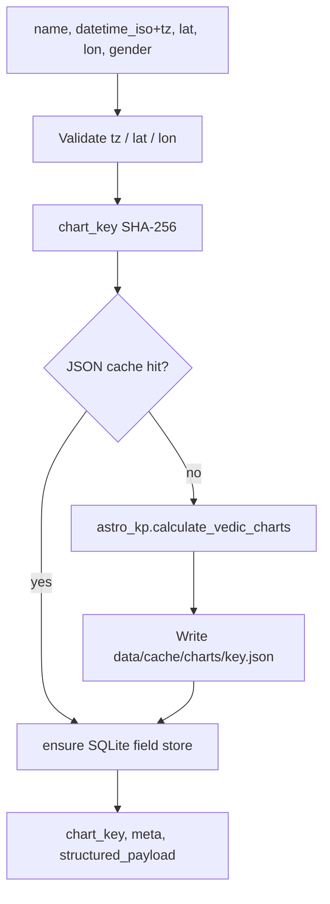
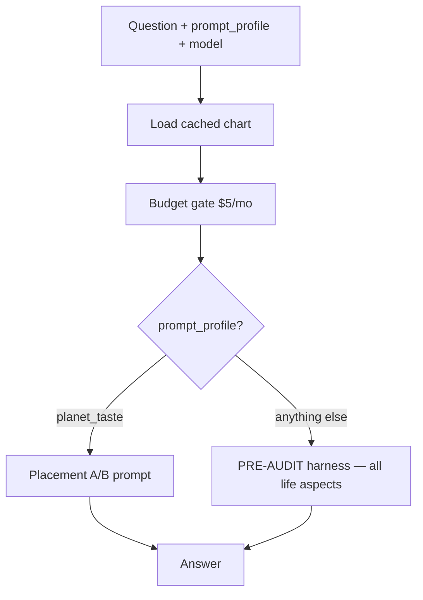
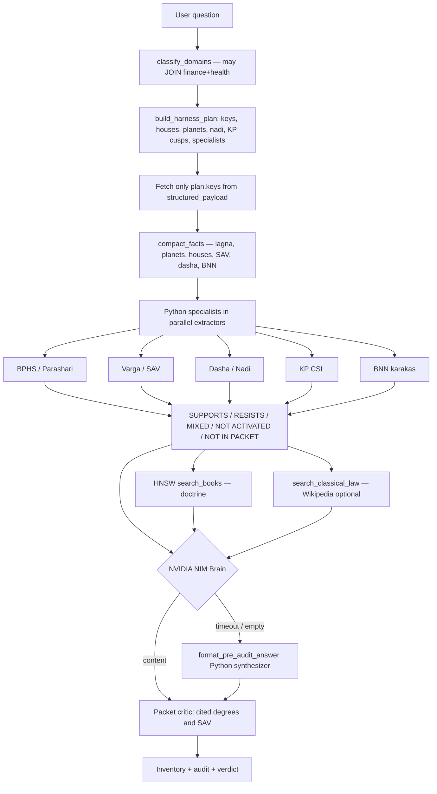
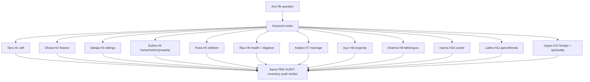
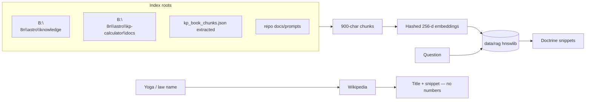
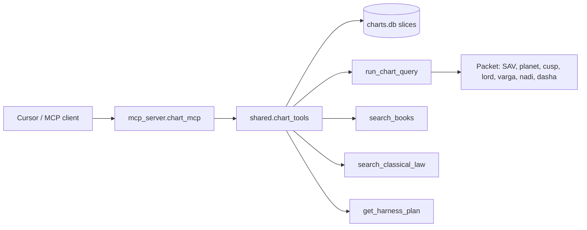
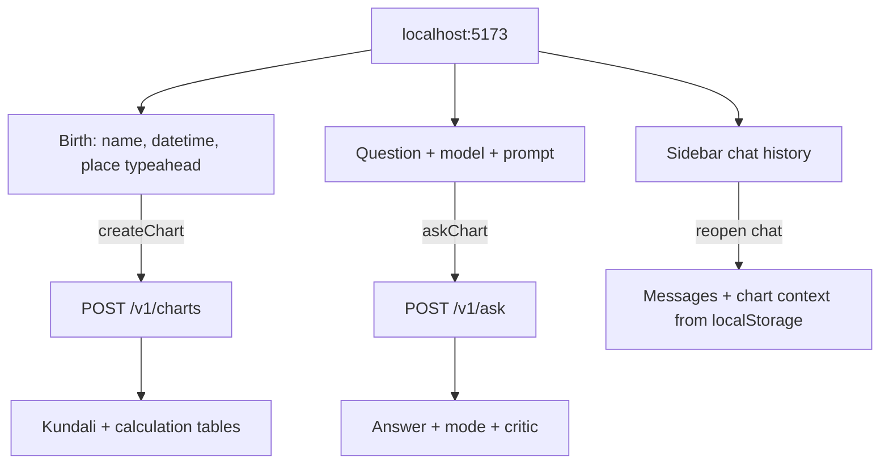

# astro_agents

Laptop-first KP astrology product: **React web app** + **FastAPI** + **PRE-AUDIT harness**. Chart math is always `engine.astro_kp.calculate_vedic_charts`. The LLM never invents longitudes, SAV, or dasha.

| Doc | What it is |
|-----|------------|
| [PRD.md](PRD.md) | Product intent |
| [API.md](API.md) | HTTP request/response contract |
| [IMPLEMENTATION_PLAN.md](IMPLEMENTATION_PLAN.md) | Milestone status |
| [docs/prompts/PRE_AUDIT_DIRECTIVE.md](docs/prompts/PRE_AUDIT_DIRECTIVE.md) | Brain output contract |
| [graphify-out/GRAPH_REPORT.md](graphify-out/GRAPH_REPORT.md) | How Python files import each other |

**Frozen Streamlit** stays on `B:\n8n\astro\kp-calculator`. Do not point Streamlit Cloud at this repo. Re-sync math into `engine/` after upstream fixes:

```powershell
robocopy "B:\n8n\astro\kp-calculator" "E:\astro_agents\engine" /E /XD .git __pycache__ data\runtime /NFL /NDL /NJH /NJS
```

---

## 1. What a user session looks like



Two processes must run or the UI is blank: API on **8080**, Vite on **5173** (proxies `/v1` and `/health`).

---

## 2. System map



**Hard rules**

| Rule | Meaning |
|------|---------|
| Math | Only `calculate_vedic_charts`. Packet is authoritative. |
| Slices | Specialists and Brain see domain keys only, not the full dump. |
| PRE-AUDIT | Inventory box → systematic evidence audit → verdict from tally. |
| RAG / Wikipedia | Doctrine (meaning of laws). Never chart numbers. |
| Budget | `$5/mo` kill-switch (`ASTRO_MONTHLY_BUDGET_USD`). |
| Streamlit | Frozen on `B:\`. |

---

## 3. Chart compute

Birth data in → one engine call → disk JSON + SQLite field rows for tools.



Payload already contains the tables specialists need: `natal_core`, `unified_kundali`, `ashtakavarga_sav`, `bnn_module`, `cusps`, `planet_star_sub_lords`, `special_yogas`, `kp_*`, dasha balance.

`GET /v1/charts/{chart_key}` reads the same JSON. City typeahead (`GET /v1/places?q=`) uses `engine/global_cities_full.csv` (same file as Streamlit). Chart compute with explicit lat/lon does not need the CSV.

---

## 4. Ask routing

`POST /v1/ask` does **not** always call the Brain the same way.



Web default prompt is **PRE-AUDIT Brain**. Every ask (except planet taste) uses the 12-bhava life map.

`mode` on the response:

| mode | When |
|------|------|
| `harness` | Brain LLM wrote the PRE-AUDIT report |
| `harness_fallback` | NIM timed out or returned empty; Python synthesizer wrote the same shape |
| `tools` | Muse tool loop |
| `fallback_planner` | Packet planner + single synthesize |

---

## 5. PRE-AUDIT harness (main product path)

This is the finance-style report: checkpoint inventory, evidence table, verdict.



Specialists are **deterministic Python** (budget: one Brain call, not five specialist LLMs). They only score rows from the compact packet.

Joined question example: `Tell me about health and finances` → both domains, merged houses (H11 and H6), merged payload keys. RAG searches the question **and** each domain's book query (BPHS/KP house lore).

### Life aspects (BPHS 12 bhavas → PRE-AUDIT)

Every question except `planet_taste` uses this map. Unknown wording falls through to **general** (life survey of H1, H2, H4, H5, H7, H10, H11).



| Aspect id | Houses | Book hook |
|-----------|--------|-----------|
| `self` | 1, 5, 9 | BPHS Tanu |
| `finance` | 2, 11, 9… | BPHS Dhana/Labha |
| `siblings` | 3, 11 | BPHS Sahaja |
| `home` | 4, 12 | BPHS Sukha; D4 |
| `children` | 5, 9, 11 | BPHS Putra; D7 |
| `health` | 1, 6, 8, 12 | BPHS Ripu/Ayur; D30 |
| `litigation` | 6, 8, 12 | BPHS Ripu (court/debt) |
| `marriage` | 7, 2, 11 | BPHS Kalatra; D9 |
| `longevity` | 1, 3, 8 | BPHS Ayur |
| `dharma` | 9, 5, 1 | BPHS Dharma (father/guru) |
| `career` | 10, 6, 11 | BPHS Karma; D10 |
| `gains` | 11, 2 | BPHS Labha |
| `foreign` | 3, 9, 12 | BPHS Vyaya |
| `spirituality` | 5, 9, 12 | BPHS moksha/dharma |
| `education` | 4, 5, 9 | vidya houses |
| `general` | 1, 2, 4, 5, 7, 10, 11 | 12-bhava survey |

Catalog API: `GET /v1/harness/aspects`. Preview one question: `GET /v1/harness/plan?q=`.

### Answer contract

1. **Inventory box** — BPHS column, Shodashavarga/SAV column, Dasha/Nadi/KP/BNN column  
2. **Systematic evidence audit** — one row per checkpoint with status and Python cite  
3. **Verdict** — YES / NO / MIXED / INSUFFICIENT DATA from SUPPORTS vs RESISTS, not from vibe  
4. **Critic** — if a degree or SAV is not in the packet, the answer is annotated (Python synthesizer is written so this stays clean)

Inspect without an LLM: `POST /v1/harness/audit` or `GET /v1/harness/plan?q=`.

---

## 6. RAG and classical-law web



Rebuild: `POST /v1/rag/index`. Search: `GET /v1/rag/search?q=...`. Tesseract/tool trees are not indexed.

---

## 7. MCP Python calc tools

Same registry as the ask agent (`shared/chart_tools.py`).

```powershell
python -m mcp_server.chart_mcp
```



| Tool | Role |
|------|------|
| `list_chart_fields` / `get_chart_slice` / `get_chart_meta` | Selective SQLite reads |
| `get_cusp` / `get_planet` | One cusp or star/sub |
| `search_places` | City typeahead |
| `get_harness_plan` | Domain join + keys |
| `search_books` | HNSW doctrine |
| `search_classical_law` | Wikipedia doctrine |
| `run_chart_query` | Allowlisted ops: `sav`, `planet`, `cusp`, `house`, `lord`, `varga`, `yogas`, `nadi`, `dasha`, `compact` |

---

## 8. Data on disk

```
E:\astro_agents\
  api/                 FastAPI
  web/                 React + Vite
  shared/              harness, RAG, tools, LLM client
  engine/              vendor copy of KP math + global_cities_full.csv
  mcp_server/          MCP stdio
  docs/prompts/        PRE_AUDIT_DIRECTIVE, planet taste, Gem
  tests/
  graphify-out/        import graph JSON
  data/
    cache/charts/      full chart JSON
    sqlite/charts.db   field store for tools
    rag/               chunks.db + hnsw.bin
    logs/pipeline.log  live traces
    sqlite/usage_*.json  monthly spend
```

Telegram (`telegram/`) is a package stub; the bot is not shipped yet. Code graph: `python scripts/build_code_graph.py`.

---

## 9. Web UI flow



Composer: **Model** (DeepSeek / Muse / MiniMax) and **Prompt** (`PRE-AUDIT Brain` / `Planet taste` / default). MiniMax on NIM trial often 429s; prefer DeepSeek.

---

## 10. How to run

**API**

```bash
cd E:\astro_agents
pip install -r requirements.txt
uvicorn api.app:app --reload --port 8080
```

Keep this terminal open. Every chart/ask prints a pipeline (`node`, `ms`, tokens, errors). Tail the same lines:

```powershell
Get-Content E:\astro_agents\data\logs\pipeline.log -Wait -Tail 40
```

**Web**

```bash
cd E:\astro_agents\web
npm install
npm run dev
```

Open http://localhost:5173.

**RAG** (after API is up)

```powershell
curl -X POST http://127.0.0.1:8080/v1/rag/index
```

**Env** (`.env` at repo root): `NVIDIA_API_KEY`, `ASTRO_MONTHLY_BUDGET_USD=5`, optional `NVIDIA_TIMEOUT_S` (fallback to Python synthesizer on timeout), `ASTRO_N8N_ROOT` (default `B:\n8n\astro`).

**Streamlit (unchanged)**

```bash
cd /d B:\n8n\astro\kp-calculator
streamlit run astro_kp_v2.py
```

---

## 11. Verify

```powershell
cd E:\astro_agents
python -m pytest tests/ -q
```

Expected: all tests pass (chart cache, harness, critic, RAG tmp index, MCP catalog, HTTP plan/health).

Python-only PRE-AUDIT (no NIM): `POST /v1/harness/audit` with a cached `chart_key`. Live NIM may time out; `mode=harness_fallback` is still a full inventory/audit/verdict report and must pass the critic.
